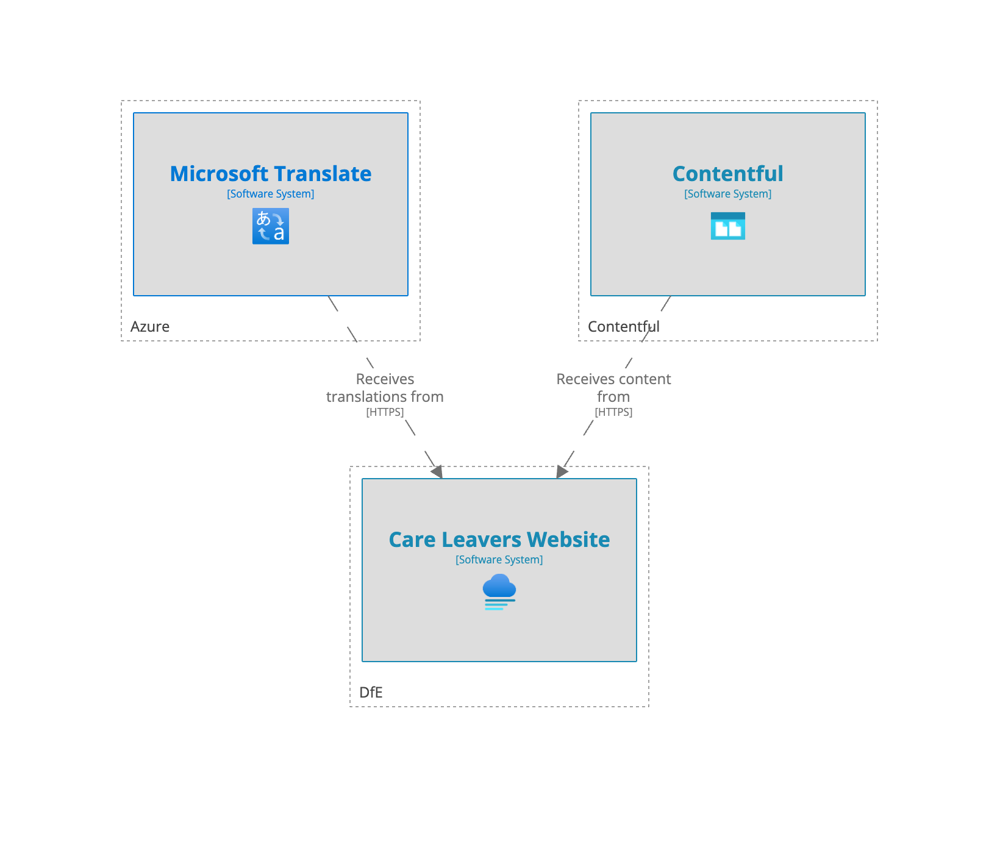
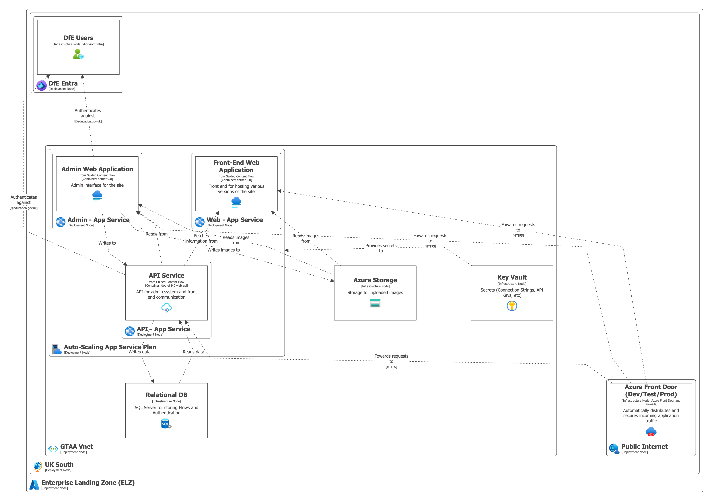

# Application Architecture

## C4: System Landscape

## C4: Deployment

## Component Summary

|      Component       | SLA                                               |
|:--------------------:|:--------------------------------------------------|
|  Azure App Service   | 99.95%                                            |
|   Azure Front Door   | 99.95%                                            |
|  Azure Redis Cache   | 99.99%                                            |
| Azure AI Translation | 99.99%                                            |
|    Contentful API    | [99.99%](https://www.contentful.com/enterprise/)  |

## Availability

The table shows the composite availability. All Services is for when the entire system is running.
Because of the nature of how Redis caches the site, if either Redis or Contentful is down, the site would be able to
effectively fail over and skip the cache/service from cache only respectively.

|         Scenario         | Availability |
|:------------------------:|:------------:|
|      All Services        |    99.64%    |
| Contentful or Redis down |    99.74%    |"