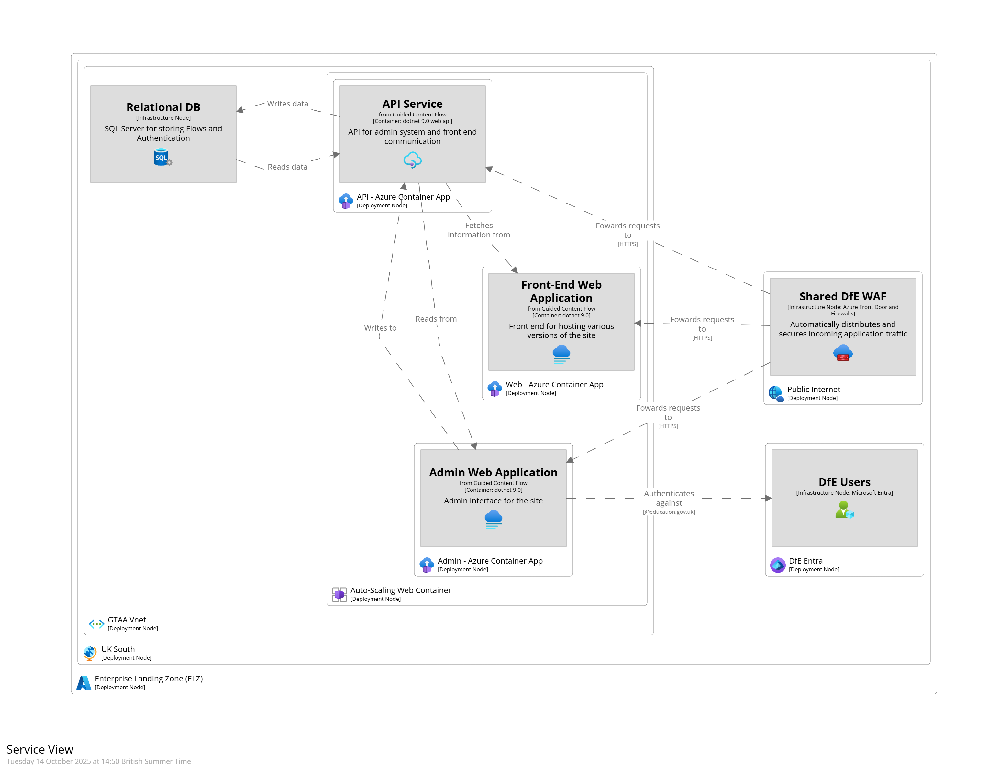

# Application Architecture

## C4: System Landscape

## C4: Deployment

## Component Summary

|       Component       | SLA                                               |
|:---------------------:|:--------------------------------------------------|
|   Azure App Service   | 99.95%                                            |
|   Azure Front Door    | 99.95%                                            |
|    Azure Key Vault    | 99.90%                                            |
| Azure Storage Account | 99.90%                                            |
|       Azure WAF       | 99.90%                                            |
|  Azure Relational DB  | 99.90%                                            |

## Availability

The table shows the composite availability. All Services is for when the entire system is running.
|   Scenario   | Availability |
|:------------:|:------------:|
| All Services |    99.90%    |