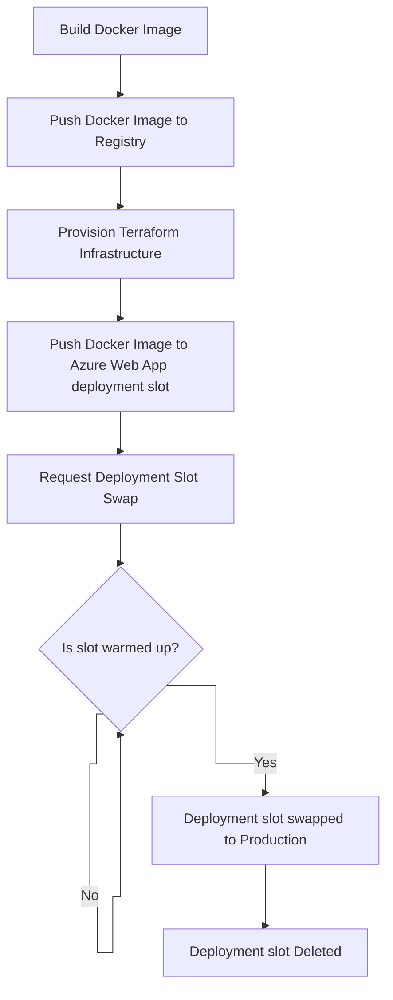
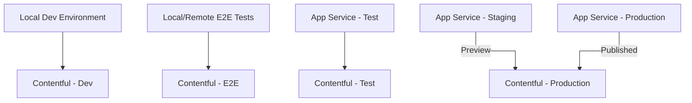
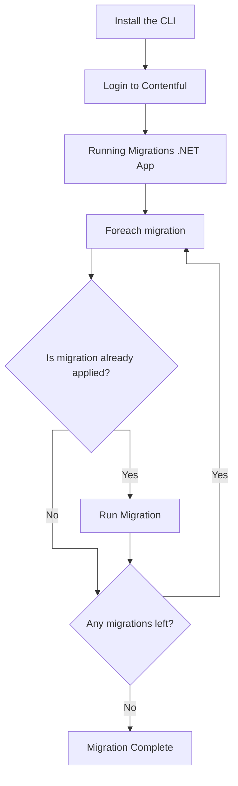

# Deployment Architecture

The build and release pipelines are all controlled via GitHub actions which act as our CI/CD process.

The actions are categorised into different types:
- **Validate**: Perform some sort of validation, such as running tests and are typically pass/fail
- **Generate**: Generate some sort of artifact, such as reporting
- **Deploy**: Perform a deployment to a target environment

## Build Pipeline

On creation of a Pull Request or push to main, multiple validation actions run, depending on what areas of the repo
have been modified. Any failures should be addressed before merging. Failures on main should be fixed as priority.

## Release Pipeline

The site is deployed via GitHub Actions.
> Before deploying a release, it is best to check if Contentful Migrations need to be applied first

Once the team is happy to publish a release, this can be done by running the "Deploy - Environment" action.

Most times the site is published, the cache will not need clearing, but if Contentful Migrations have changed the structure of any of the models, you will also need to select "True" when asked whether to clear the cache.

Publishing runs the following steps:

## Contentful Models Deployment

Contentful Models are deployed via Contentful Migrations through the Contentful CLI. Because contentful and app service environments
are not one-to-one, the release process is managed seperately.

### App Service to Contentful Environment Mapping

### Contentful Migration Process

The Contentful migration process is executed either locally (in development), or using the GitHub Action "Deploy - Contentful Migrations", at which point you are asked which environment you wish to run the deployment against