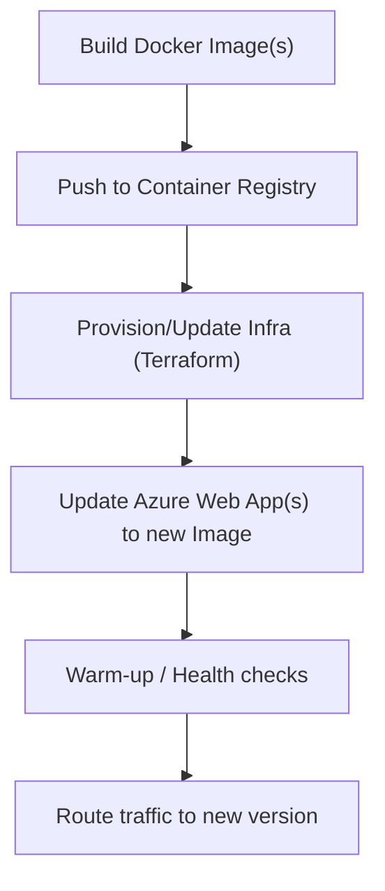

# Deployment Architecture

GitHub Actions provide CI/CD for this repository. Workflows are grouped by purpose:
- Validate: build, run tests (unit/integration/E2E), and static analysis; gate changes.
- Generate: produce artifacts such as documentation and security reports.
- Deploy: provision/update infrastructure and release application containers.

## Build pipeline

Triggered on pull requests and pushes to main:
- Path-aware validation runs only what’s relevant (apps, tests, docs).
- Fix any failures before merging; failures on main are priority.

## Release pipeline

Applications (API, Admin, Frontend) are deployed via GitHub Actions to target environments.
- Choose the appropriate “Deploy — <App>” workflow for the environment.
- Caching: only clear caches when structural or configuration changes require it.

Conceptual deployment flow:

## Environments

- Local: run via IDE or Docker Compose.
- Shared environments (e.g., Development/Test): deployed by GitHub Actions to Azure resources defined in IaC.

## What gets deployed

- Infrastructure as Code: network, registries, app services, databases, and related resources.
- Applications: API, Admin, and Frontend containers.
- Supporting artifacts: documentation and security/accessibility scan outputs from Generate workflows.

## Operator guidance

- Pick the correct environment in the Deploy workflow.
- Monitor workflow logs and application health endpoints after deployment.

