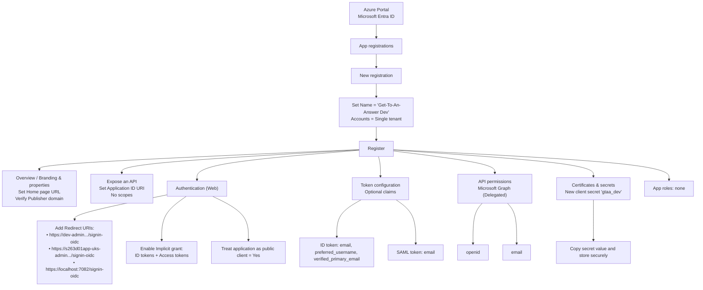

# Azure App Registration in Azure Portal

## Prerequisites
- Azure portal access with permissions to create and configure App registrations in the Educationgovuk.onmicrosoft.com tenant.
- The app is single-tenant (My organization only).

### Mermaid overview


1) Create the App Registration
- Azure Portal → Microsoft Entra ID → App registrations → New registration
    - Name: Get-To-An-Answer Dev
    - Supported account types: Accounts in this organizational directory only (Single tenant)
    - Redirect URI: Leave blank for now
- Click Register.

2) Set Basic Properties
- Overview: verify Display name and note the Application (client) ID.
- Branding & properties:
    - Publisher domain: Educationgovuk.onmicrosoft.com
    - Description (optional): The Admin project is a secure back-office web application for planning, editing, previewing, and publishing questionnaires used by the service. It enables authorised users to model question flows, manage content, collaborate with contributors, and control versioning and publication lifecycle.
    - Home page URL: https://dev-admin.get-to-an-answer.education.gov.uk

3) Expose an API (identifier URI)
- Expose an API → Set Application ID URI: api://client-id-guid
- Do not add scopes.

4) Authentication (Web app)
- Authentication → Add a platform → Web
    - Redirect URIs:
        - https://dev-admin.get-to-an-answer.education.gov.uk/signin-oidc
        - ...
        - https://localhost:7082/signin-oidc
    - Front-channel logout URL: leave blank
    - Implicit grant and hybrid flows: check ID tokens and Access tokens
- Default client type: Treat application as a public client = Yes (matches isFallbackPublicClient = true)
- Save.

5) Optional Claims
- Token configuration → Add optional claim
    - ID token: email, preferred_username, verified_primary_email
    - SAML: email
- Save.

6) API Permissions (Microsoft Graph)
- API permissions → Add a permission → Microsoft Graph → Delegated
    - openid
    - email
- Add permissions → Grant admin consent if required.

7) Client Secret
- Certificates & secrets → Client secrets → New client secret
    - Description: gtaa_dev
    - Expires: per policy (example aligns with ~2 years)
- Create and copy the secret Value immediately; store securely.

8) App Roles
- None (leave empty).

9) SPA configuration
- None (leave empty). 

### Or Save in Manifest 

```json
{
  "id": "object-id-guid",
  "deletedDateTime": null,
  "appId": "app-id-guid",
  "applicationTemplateId": null,
  "disabledByMicrosoftStatus": null,
  "createdDateTime": "2025-11-04T19:26:39Z",
  "displayName": "Get-To-An-Answer Dev",
  "description": null,
  "groupMembershipClaims": "None",
  "identifierUris": [
    "api://client-id-guid"
  ],
  "isDeviceOnlyAuthSupported": null,
  "isFallbackPublicClient": true,
  "nativeAuthenticationApisEnabled": null,
  "notes": "The Admin project is a secure back-office web application for planning, editing, previewing, and publishing questionnaires used by the service. It enables authorised users to model question flows, manage content, collaborate with contributors, and control versioning and publication lifecycle.\n",
  "publisherDomain": "Educationgovuk.onmicrosoft.com",
  "serviceManagementReference": "ELZ-S263D01-Get-To-An-Answer",
  "signInAudience": "AzureADMyOrg",
  "tags": [],
  "tokenEncryptionKeyId": null,
  "samlMetadataUrl": null,
  "defaultRedirectUri": null,
  "certification": null,
  "requestSignatureVerification": null,
  "addIns": [],
  "api": {
    "acceptMappedClaims": null,
    "knownClientApplications": [],
    "requestedAccessTokenVersion": null,
    "oauth2PermissionScopes": [],
    "preAuthorizedApplications": []
  },
  "appRoles": [],
  "info": {
    "logoUrl": null,
    "marketingUrl": null,
    "privacyStatementUrl": null,
    "supportUrl": null,
    "termsOfServiceUrl": null
  },
  "keyCredentials": [],
  "optionalClaims": {
    "accessToken": [],
    "idToken": [
      {
        "additionalProperties": [],
        "essential": false,
        "name": "verified_primary_email",
        "source": null
      },
      {
        "additionalProperties": [],
        "essential": false,
        "name": "email",
        "source": null
      },
      {
        "additionalProperties": [],
        "essential": false,
        "name": "preferred_username",
        "source": null
      }
    ],
    "saml2Token": [
      {
        "additionalProperties": [],
        "essential": false,
        "name": "email",
        "source": null
      }
    ]
  },
  "parentalControlSettings": {
    "countriesBlockedForMinors": [],
    "legalAgeGroupRule": "Allow"
  },
  "passwordCredentials": [
    {
      "customKeyIdentifier": null,
      "displayName": "gtaa_dev",
      "endDateTime": "2027-11-04T20:59:56.867Z",
      "hint": "hint",
      "keyId": "key-id-guid",
      "secretText": null,
      "startDateTime": "2025-11-04T20:59:56.867Z"
    }
  ],
  "publicClient": {
    "redirectUris": []
  },
  "requiredResourceAccess": [
    {
      "resourceAppId": "app-id-guid",
      "resourceAccess": [
        {
          "id": "64a6cdd6-aab1-4aaf-94b8-3cc8405e90d0",
          "type": "Scope"
        },
        {
          "id": "7427e0e9-2fba-42fe-b0c0-848c9e6a8182",
          "type": "Scope"
        },
        {
          "id": "37f7f235-527c-4136-accd-4a02d197296e",
          "type": "Scope"
        },
        {
          "id": "14dad69e-099b-42c9-810b-d002981feec1",
          "type": "Scope"
        },
        {
          "id": "e1fe6dd8-ba31-4d61-89e7-88639da4683d",
          "type": "Scope"
        }
      ]
    }
  ],
  "verifiedPublisher": {
    "displayName": null,
    "verifiedPublisherId": null,
    "addedDateTime": null
  },
  "web": {
    "homePageUrl": "https://dev-admin.get-to-an-answer.education.gov.uk",
    "logoutUrl": null,
    "redirectUris": [
      "https://dev-admin.get-to-an-answer.education.gov.uk/signin-oidc",
      "...",
      "https://localhost:7082/signin-oidc"
    ],
    "implicitGrantSettings": {
      "enableAccessTokenIssuance": true,
      "enableIdTokenIssuance": true
    },
    "redirectUriSettings": [
      {
        "uri": "https://dev-admin.get-to-an-answer.education.gov.uk/signin-oidc",
        "index": null
      },
      {
        "uri": "...",
        "index": null
      },
      {
        "uri": "https://localhost:7082/signin-oidc",
        "index": null
      }
    ]
  },
  "servicePrincipalLockConfiguration": {
    "isEnabled": true,
    "allProperties": true,
    "credentialsWithUsageVerify": true,
    "credentialsWithUsageSign": true,
    "identifierUris": false,
    "tokenEncryptionKeyId": true
  },
  "spa": {
    "redirectUris": []
  }
}
```

## Quick reference (what to put where)
- Name: Get-To-An-Answer Dev
- Supported accounts: Single tenant (My organization only)
- Home page URL: https://dev-admin.get-to-an-answer.education.gov.uk
- Application ID URI: api://your-client-id
- Web redirect URIs:
    - https://dev-admin.get-to-an-answer.education.gov.uk/signin-oidc
    - ...
    - https://localhost:8080/signin-oidc
- Implicit grant: Enable ID tokens and Access tokens
- Public client: Enabled (Treat as public client)
- Optional claims (ID token): email, preferred_username, verified_primary_email
- Optional claims (SAML): email
- API permissions (Microsoft Graph, Delegated): openid, email
- Client secret: Create “gtaa_dev” and store the value securely

## Integration values for your app
- Tenant ID
- Client ID (Application ID)
- Client Secret value
- Redirect URI(s)
- Authority and scopes (e.g., openid, email)

```json
  "AzureAd": {
    "Instance": "https://login.microsoftonline.com/",
    "Domain": "Educationgovuk.onmicrosoft.com",
    "TenantId": "{ Tenant Id }",
    "ClientId": "{ Application (client) Id }",
    "ClientSecret": "{ Add via 'Certificates & secrets' }",
    "CallbackPath": "/signin-oidc",
    "Scope": "openid profile email offline_access api://{ Application (client) Id }/.default",
    "ForceConsentPrompt": "{ custom field to force consent prompt : true|false }"
  }
```