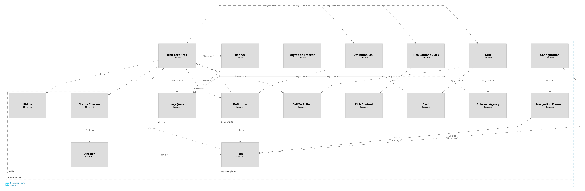

# Information Architecture

## Contentful API

The Contentful API is a cloud-based headless CMS that allows for the creation, management, and delivery of content to any platform or device. 
The API is used to retrieve content from the Contentful CMS and display it on the website.

## Contentful Models

