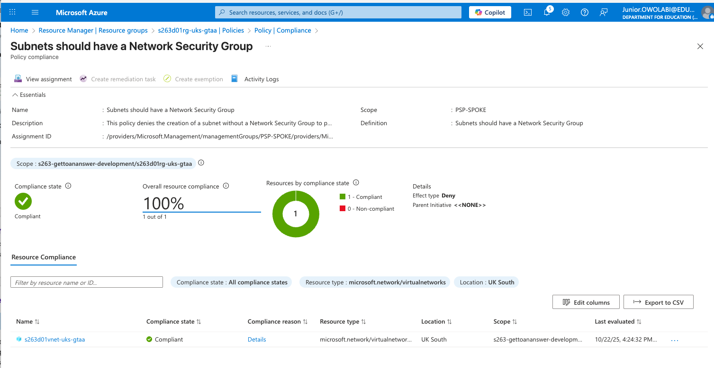

# Decision - 0001 - Azure ELZ Terraform Subnet Alternative

## Context and Problem Statement

When deploying to the Enterprise Landing Zone (ELZ) we encountered a major blocker: a policy repeatedly caused our Terraform infrastructure deployment to fail. 

There was considerable research and experimentation (plus, leveraging colleagues’ suggestions).

We found that:

- The subnet resource was being rejected due to the following policy:



- To resolve this, it was suggested to use the property below (however, in the current Terraform provider it has been deprecated):
```terraform
resource "azurerm_subnet" "gettoananswer-subnet" {
...
network_security_group_id = azurerm_network_security_group.gettoananswer-nsg.id
...
}
```
- Another suggestion was to use association resource, but this was also unsuccessful:
```terraform
resource "azurerm_subnet_network_security_group_association" "default" {
subnet_id                 = azurerm_subnet.gettoananswer_main_subnet.id
network_security_group_id = azurerm_network_security_group.gettoananswer-nsg.id
}
```
As part of further investigations, we noted that:

- The issue was ELZ-specific and a bug was raised to fix it, so an exemption, policy change or alternative was required.

## Considered Options

- Use the AzAPI provider to customise the creation of the subnet.
- Use click-ops to create the subnet with the association, then import the resource to complete provisioning.
- Use a custom provider to implement the creation based on the open PR fix [here](https://github.com/hashicorp/terraform-provider-azurerm/pull/28985).
- Add an exception to the policy.
- Ask ELZ admins to change the policy effect from `deny` to `audit`.
- Replace Terraform with Bicep.
- Replace Terraform with ARM.

### Evaluation

|    Criteria     | Comment                                                                     | AzAPI | Click-ops | Custom | Exemption | Alter Policy | Bicep  |  ARM   |
|:---------------:|:----------------------------------------------------------------------------|:-----:|:---------:|:------:|:---------:|:------------:|:------:|:------:|
|   Automatable   | Can be implemented in IaC and automated across environments.                |   5   |     0     |   5    |     1     |      1       |   5    |   5    |
|   Repeatable    | Can other teams leverage this solution/workaround for their use cases too?  |   5   |     2     |   4    |     3     |      5       |   5    |   5    |
|     Effort      | How easy is it to set up/configure and deploy?                              |   5   |     3     |   3    |     1     |      1       |   3    |   2    |
| Error Resistant | Can human error be avoided/mitigated via this approach?                     |   5   |     1     |   4    |     4     |      4       |   4    |   4    |
|    **Total**    |                                                                             | **20**|  **7**    | **16** |  **9**    |    **11**    | **17** | **16** |

Notes on Bicep and ARM scoring:
- Automatable/Repeatable: Both compile to ARM and can express the subnet NSG reference inline, aligning with ELZ policy expectations.
- Effort: Though they can be AI generated from the existing Terraform, there many be unforeseen challenges when using them. I've also found it much simpler to author in Bicep, but we want to minimise the drift between the IaC scripts in Care Leavers and this project, given they will both be housed under the same team.
- Error Resistance: Strong typing and validation (esp. Bicep) reduce drift, but cross-stack state and outputs add integration complexity if mixed with Terraform.

## Decision Outcome

Based on the analysis above, we chose to switch to AzAPI, as it required the least effort, was easily repeatable by other teams using Terraform, and did not require Azure admin support.

With the AzAPI resource we can create the subnet and then associate it with a network security group.

This is the replacement (AzAPI) resource:
```terraform
resource "azapi_resource" "gettoananswer_main_subnet" {
type      = "Microsoft.Network/virtualNetworks/subnets@2024-05-01"
name      = "${var.prefix}subnet-uks-gtaa"
parent_id = azurerm_virtual_network.gettoananswer_vnet.id

body =  {
properties = {
addressPrefixes = [...]
delegations = [{
name = "asp-delegation"
properties = {
serviceName = "Microsoft.Web/serverFarms"
}
}]
serviceEndpoints = [
{
service   = "Microsoft.Sql"
locations = [azurerm_resource_group.gettoananswer-rg.location]
}
]
# the association with the network security group
networkSecurityGroup = {
id = azurerm_network_security_group.gettoananswer-nsg.id
}
}
}

depends_on = [azurerm_network_security_group.gettoananswer-nsg]
}
```
### Considerations on selected technology

Due to the flexibility of the `azapi_resource`, you'll have to periodically check when changes are made to the resource attributes and change according, because `terraform validation` doesn't flag this.

- AzAPI keeps us within the Terraform workflow.
- Lower immediate effort while still expressing the exact ARM contract needed by ELZ policies.

Note: If organisational standards move towards changing the policy to `audit` instead of `deny` or adding exemptions, we can switch back to `azurerm_subnet`.

