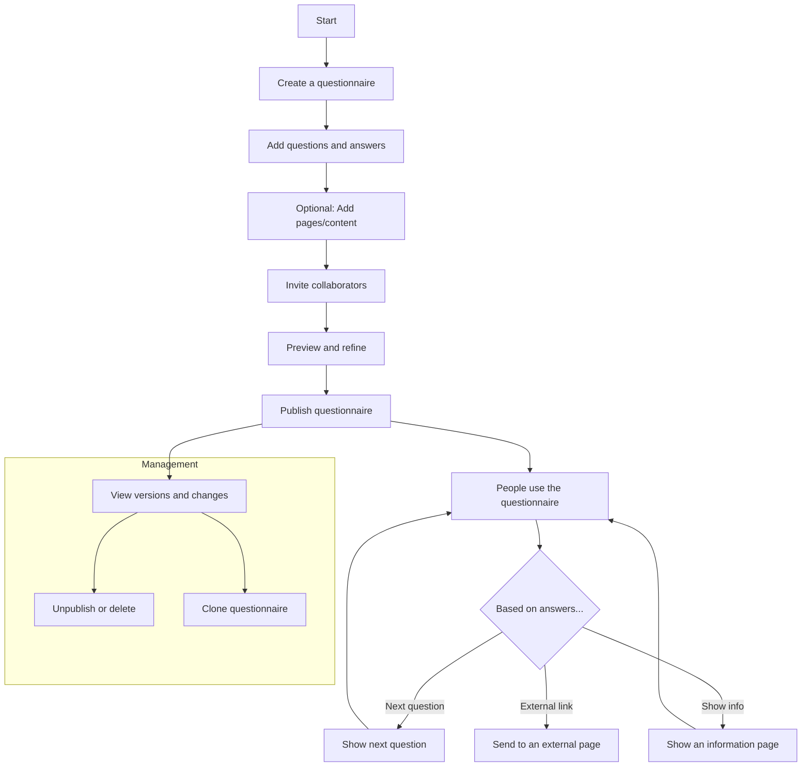

# Get-To-An-Answer service workflow

## Workflow

1) Create
- You start by creating a new questionnaire and giving it a title.
- You can come back to edit the title, description, and web address (slug).

2) Build
- Add questions in the order you want people to see them.
- For each question, add possible answers.
- You can optionally add information pages that can be shown based on someone’s answers (for example, guidance or next steps).

3) Collaborate
- Invite colleagues to help edit the questionnaire.
- Contributors can add questions, answers, and content, and help prepare it for publishing.

4) Preview
- Try out the questionnaire as if you were a user.
- Check that the order of questions makes sense and that each answer leads to the right next step (another question, an internal info page, or an external link).

5) Publish
- When ready, publish the questionnaire so people can use it.
- Each time you publish, a version is saved so you can see what changed over time.

6) Use
- People visit your questionnaire.
- They answer questions and, depending on their choices, are taken to:
    - the next relevant question,
    - an internal information page, or
    - an external website link.
7) Manage
- View the history of published versions and the changes between them.
- You can unpublish to take it back to draft for further edits.
- You can also clone an existing questionnaire to reuse its structure and content.

Mermaid diagram (high-level, user-focused)

