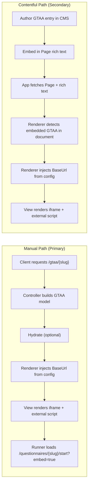

# GetToAnAnswer (GTAA) Integration Guide

Primary path: Manual embed route your app can use immediately.  
Secondary path: Contentful-driven embed via rich text.




## What you’ll add

- A model for the content type with Title, questionnaireSlug, BaseUrl.
- A renderer that supports embedded GTAA and sets BaseUrl from config.
- A shared view that renders the iframe and external script.
- An optional controller endpoint for manual embedding by slug.
- Config: GetToAnAnswer:BaseUrl.
- CSP: allow the runner host to be framed.

---

## Manual Path (Primary)

Use this when you don’t need CMS authorship. It exposes an embed route that renders a page with the questionnaire iframe.

1) Model
```csharp
// C#
namespace MyApp.Web.Models.Content;

public class GetToAnAnswer : ContentfulContent
{
    public static string ContentType => "getToAnAnswer";
    public string? Title { get; set; }
    public string? questionnaireSlug { get; set; }
    public string? BaseUrl { get; set; }
}
```


2) Renderer
```csharp
// C#
using Contentful.Core.Models;
using Microsoft.Extensions.Configuration;
using MyApp.Web.Models.Content;

public class GDSGetToAnAnswerRenderer(IServiceProvider sp) : GDSRazorContentRenderer(sp)
{
    private readonly IConfiguration _cfg = sp.GetRequiredService<IConfiguration>();

    public override bool SupportsContent(IContent content)
    {
        if (content is EntryStructure s && s.NodeType == "embedded-entry-block")
            return s.Data.Target is GetToAnAnswer;

        return content is GetToAnAnswer;
    }

    public override Task<string> RenderAsync(IContent content)
    {
        GetToAnAnswer? model =
            content as GetToAnAnswer ??
            (content as EntryStructure)?.Data.Target as GetToAnAnswer;

        if (model is not null)
            model.BaseUrl = _cfg["GetToAnAnswer:BaseUrl"];

        return RenderToString("GetToAnAnswer", model);
    }
}
```


Register it with your renderer setup:
```csharp
// C#
renderer.AddRenderer(new GDSGetToAnAnswerRenderer(serviceProvider));
```


3) View (shared partial to render the iframe)
```cshtml
// Razor
@model MyApp.Web.Models.Content.GetToAnAnswer

<div class="gtaa-wrapper" style="margin:0 auto; max-width:100%; width:100%;">
  <iframe id="gtaaFrame"
          title="@Model.Title"
          src="@Model.BaseUrl/questionnaires/@Model.questionnaireSlug/start?embed=true"
          allow="autoplay"
          referrerpolicy="strict-origin"
          sandbox="allow-scripts allow-top-navigation allow-forms"
          style="width:100%; height:100%; border:none;"></iframe>
</div>
<script asp-add-nonce="true" src="@Model.BaseUrl/js/gtaa.external.js"></script>
```


Optional CSS (if not inlined):
```css
/* CSS */
.gtaa-wrapper iframe { width:100%; height:100%; border:none; }
```


4) Controller (convenience endpoint)
```csharp
// C#
using Contentful.Core.Models;
using Microsoft.AspNetCore.Mvc;
using MyApp.Web.Contentful;
using MyApp.Web.Models.Content;

[Route("gtaa")]
public class GetToAnAnswerController(IContentService content) : Controller
{
    [HttpGet("{slug}")]
    public async Task<IActionResult> Embedded(string slug)
    {
        var stub = new GetToAnAnswer { questionnaireSlug = slug, Sys = new SystemProperties { Id = slug } };
        var hydrated = await content.Hydrate(stub);
        var page = new Page { MainContent = new Document { Content = [hydrated] } };
        return View("EmbeddedGetToAnAnswer", page);
    }
}
```


5) Configuration
```json
// JSON
{
  "GetToAnAnswer": {
    "BaseUrl": "https://your-questionnaire-host.example.com"
  }
}
```


6) CSP (frames)
```csharp
// C#
x.AllowFraming.FromSelf();
x.AllowFrames.From("https://your-questionnaire-host.example.com");
```


7) How to use
- Navigate to /gtaa/{slug} to render the runner using that slug.
- Or render a GetToAnAnswer model directly in any page’s rich text; the renderer will output the iframe.

---

## Contentful Path (Secondary)

Use this when you want editors to manage the block and embed it in rich text.

1) Migration
```textmate
// JavaScript
module.exports = function (migration) {
  const gtaa = migration.createContentType('getToAnAnswer')
    .name('GetToAnAnswer')
    .displayField('title')
    .description('Embeddable iframe that renders a questionnaire runner');

  gtaa.createField('title').name('Title').type('Symbol').required(true);
  gtaa.createField('questionnaireSlug')
    .name('Questionnaire Slug')
    .type('Symbol')
    .validations([{ regexp: { pattern: '^([a-zA-Z0-9|-]).+' }, message: 'Must be a questionnaire slug' }]);
  gtaa.changeEditorInterface('questionnaireSlug', 'singleLine');

  const page = migration.editContentType('page');
  page.editField('mainContent').validations([
    { enabledMarks: ['bold', 'italic'] },
    { enabledNodeTypes: ['heading-2','heading-3','heading-4','ordered-list','unordered-list','embedded-entry-block','embedded-asset-block','entry-hyperlink','hyperlink','embedded-entry-inline','hr','table'] },
    { nodes: { 'embedded-entry-block': [{ linkContentType: ['definitionContent','callToAction','grid','richContentBlock','banner','statusChecker','riddle','getToAnAnswer','spacer','button'] }] } }
  ]);
};
```


2) Entity mapping
```csharp
// C#
private static readonly Dictionary<string, Type> ContentTypeMap = new()
{
    // ...
    { GetToAnAnswer.ContentType, typeof(GetToAnAnswer) }
};
```


3) Authoring flow
- Create a GetToAnAnswer entry with Title and questionnaireSlug.
- Embed it in a page rich text field as an embedded entry block.
- Publish. The renderer injects BaseUrl and outputs the iframe.

---

## Troubleshooting

- Blank iframe: verify BaseUrl and CSP frame allowances.
- 404 in iframe: check questionnaireSlug and host route shape.
- No render in rich text: confirm content type ID and mapping; renderer SupportsContent covers embedded-entry-block.
- CSP script issues: ensure nonces and the host script origin are permitted.