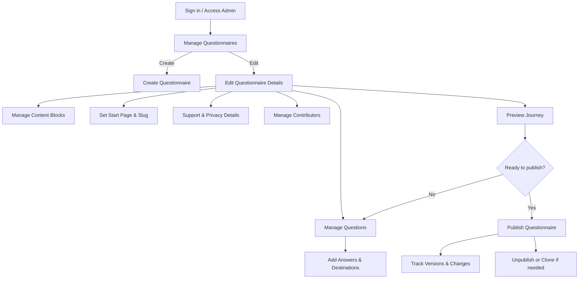
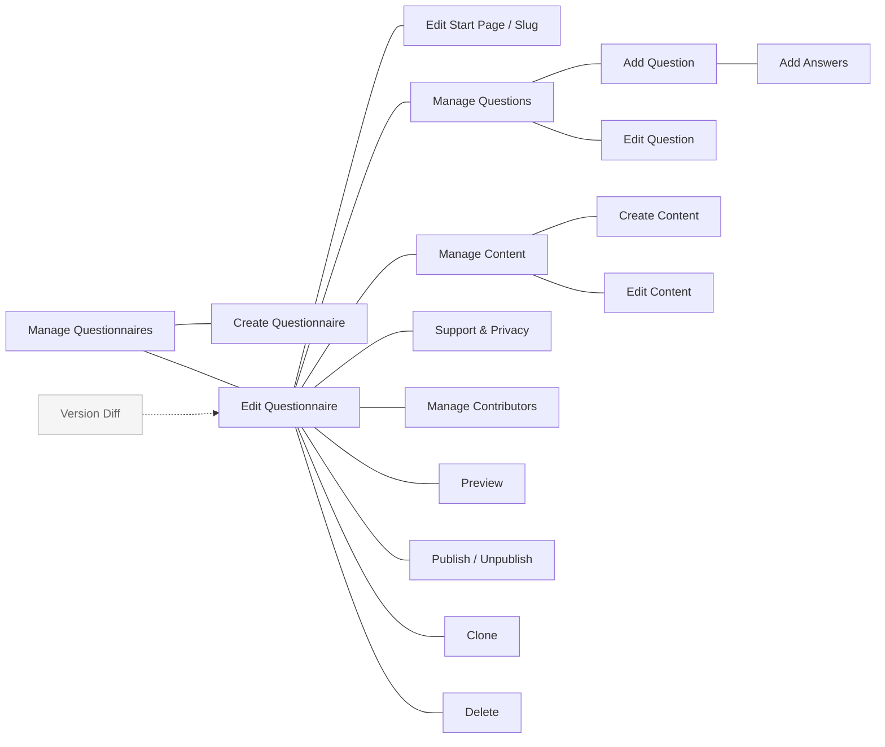

# Admin — Questionnaire Management Console

The Admin project is a secure back-office web application for planning, editing, previewing, and publishing questionnaires used by the service. It enables authorised users to model question flows, manage content, collaborate with contributors, and control versioning and publication lifecycle.

## Key capabilities
- Create and organise questionnaires, questions, and answers
- Manage content blocks, start pages, and slugs
- Configure support contact details and privacy information
- Invite/manage contributors and track changes over time
- Preview questionnaire journeys before publishing
- Publish, unpublish, clone, and delete questionnaires with version history

## User flow (high level)

## Pages and purpose

- Manage Questionnaires: list and access drafts/published items.
- Create Questionnaire: start a new questionnaire draft.
- Edit Questionnaire: change titles, descriptions, and settings.
- Edit Start Page / Slug: configure entry content and public URL path.
- Manage Questions: view ordering and structure of questions.
- Add Question / Edit Question: define prompts, types, and help text.
- Add Answers: add options, routing destinations, scores.
- Manage Content: list reusable content blocks for the journey.
- Create Content / Edit Content: author and update content blocks.
- Support & Privacy: configure support contact details and privacy info.
- Manage Contributors: invite/remove collaborators.
- Preview: simulate the end-user journey before release.
- Publish / Unpublish: control visibility and create version snapshots.
- Clone: duplicate an existing questionnaire for iteration.
- Delete: remove a questionnaire (subject to rules).
- Version Diff: compare versions to see what changed.