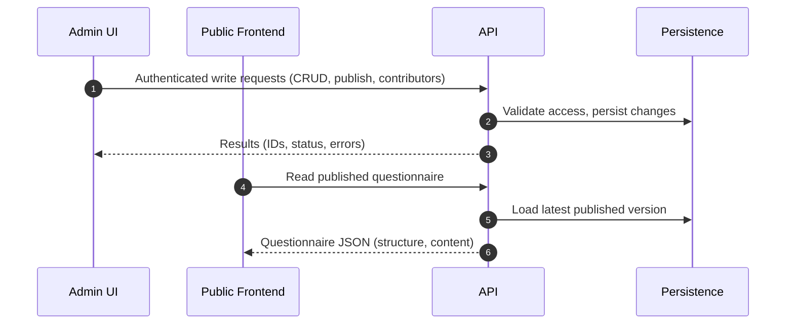
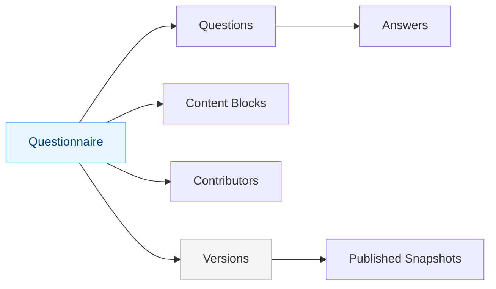

# API — Questionnaire Service Backend

The API project provides the backend HTTP endpoints for managing and serving questionnaire data. It supports secure operations for authoring and lifecycle management, and exposes read endpoints for the public experience to consume published content.

## Key capabilities
- Create, read, update, publish/unpublish, delete questionnaires
- Manage questions, answers, content, and contributors
- Clone questionnaires and track versioned snapshots
- Expose read endpoints consumed by Frontend

## High-level request flow

## Domain interactions

## Endpoint purposes (conceptual)
- Questionnaires: create, get one/list, update metadata, publish/unpublish/delete.
- Questions: add/edit/remove questions within a questionnaire.
- Answers: add/edit/remove answers, destinations, and scoring.
- Content: manage reusable content blocks.
- Contributors: list/add/remove collaborators.
- Versions: store and retrieve published snapshots for diffing and rollback scenarios.