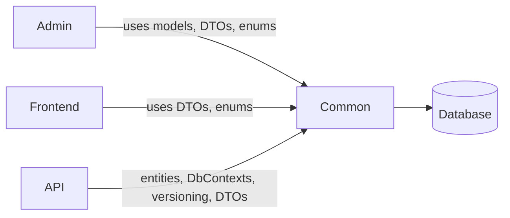
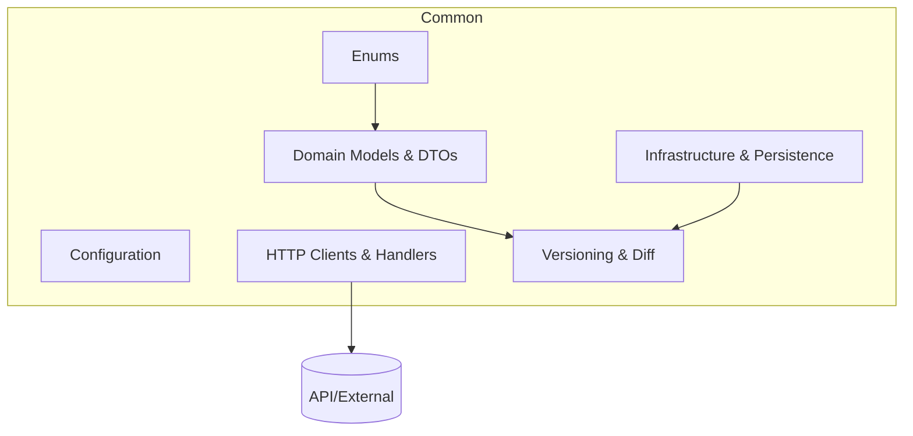

# Common — Shared Domain and Infrastructure Library

The Common project centralises shared code used by Admin, Frontend, and API. It defines cross-cutting domain models, enums, configuration, persistence abstractions, clients, and utilities to ensure consistency and reuse across the solution.

## Key capabilities
- Domain models and DTOs for questionnaires, questions, answers, content, versions
- Shared enums (statuses, destination types, question types)
- Configuration objects and helpers
- Persistence layer entities and DbContexts used by the API
- HTTP clients and handlers for cross-service calls
- Versioning utilities for snapshotting and diffing questionnaire content

## How it fits in




## Module overview




- Domain Models & DTOs: canonical structures for data exchange and storage.
- Enums: shared constants for status, question types, destinations, etc.
- Configuration: typed settings and options used across services.
- Infrastructure & Persistence: shared EF entities/contexts and persistence helpers.
- HTTP Clients & Handlers: common API client logic and auth handlers.
- Versioning & Diff: helpers to snapshot and compare questionnaire versions.

## EF Core migrations

EF Core migrations are managed across this and the API project using the [dotnet-ef](https://docs.microsoft.com/en-us/ef/core/miscellaneous/cli/dotnet) CLI tool.

The following was the initial migration command, used to create the base state for any future migrations:
```bash
# Ran from the root of the solution
dotnet ef migrations add InitialCreate \
  --project src/Common/Common.csproj \
  --startup-project src/Api/Api.csproj
```
The output was:
```log
Build started...
Build succeeded.
[06:25:11 INF] Starting application
[06:25:11 INF] Environment: Development
Done. To undo this action, use 'ef migrations remove'
```

### Subsequent migrations

After you’ve changed your EF Core entities, there are **two steps**:

1. **Create a new migration**
2. **Apply (update) the database**

---

#### 1. Command to create *subsequent* migrations

You use the *same* `dotnet ef migrations add` command as for the first migration, but with a **new name** that describes the change.

Example:

```shell script
dotnet ef migrations add AddContactDetailsToQuestionnaire \
  --project src/Common/Common.csproj \
  --startup-project src/Api/Api.csproj
```

Key points:

- Run this **every time** you change the model (entities/DbContext) and want to capture changes in a migration.
- Use a descriptive migration name (no spaces): `RenameUserTable`, `AddIsActiveFlag`, etc.

---

#### 2. Command to update the database from CLI

To apply the migrations to your database from the command line:

```shell script
dotnet ef database update \
  --project src/Common/Common.csproj \
  --startup-project src/Api/Api.csproj
```

This will apply **all pending migrations** (including the new one) to the configured database.

---

#### 3. Applying migrations automatically in `Program.cs`

If you want your API to apply migrations on startup **only when there are pending migrations**, you can do something like this in `Program.cs`

```csharp
using Microsoft.EntityFrameworkCore;
// ... other usings

var app = builder.Build();

// Apply migrations automatically if there are any pending
using (var scope = app.Services.CreateScope())
{
    var services = scope.ServiceProvider;

    try
    {
        var db = services.GetRequiredService<GetToAnAnswerDbContext>();

        // Only run if there are pending migrations
        if (db.Database.GetPendingMigrations().Any())
        {
            db.Database.Migrate();
        }
    }
    catch (Exception ex)
    {
        // Decide how you want to handle failures:
        // - log and continue (risky if schema mismatch)
        // - log and rethrow (fail fast)
        var logger = services.GetRequiredService<ILogger<Program>>();
        logger.LogError(ex, "An error occurred while applying database migrations.");
        throw; // recommended in most cases
    }
}

// ...

app.Run();
```

##### What this does

- At startup, it creates a **scope** so DI can resolve `GetToAnAnswerDbContext`.
- Calls `GetPendingMigrations()`:
    - If there are any → calls `MigrateAsync()` (which applies all pending migrations).
    - If none → does nothing.
- This is safe to call even if no migrations are pending; `GetPendingMigrations()` prevents unnecessary work.
e your actual DbContext class name and which project contains it, I can give you a `Program.cs` snippet tailored exactly to your solution structure.