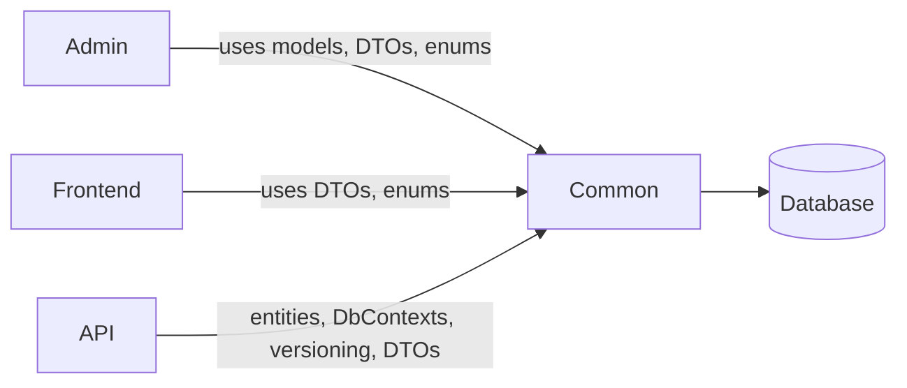
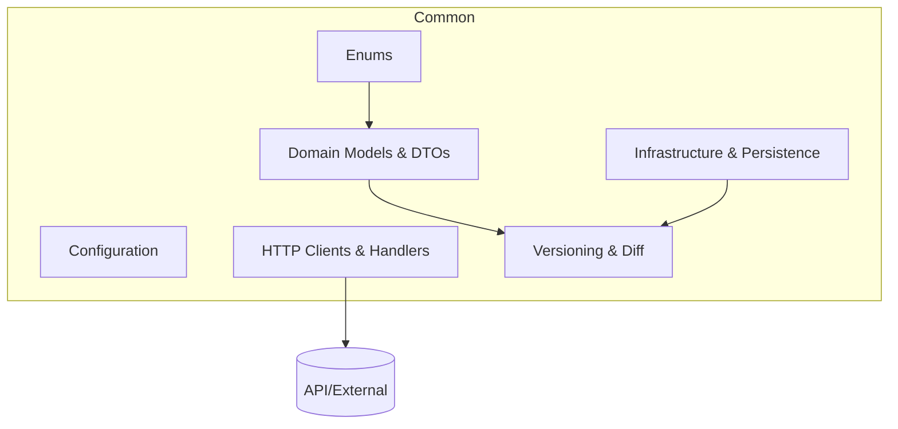

# Common — Shared Domain and Infrastructure Library

The Common project centralises shared code used by Admin, Frontend, and API. It defines cross-cutting domain models, enums, configuration, persistence abstractions, clients, and utilities to ensure consistency and reuse across the solution.

## Key capabilities
- Domain models and DTOs for questionnaires, questions, answers, content, versions
- Shared enums (statuses, destination types, question types)
- Configuration objects and helpers
- Persistence layer entities and DbContexts used by the API
- HTTP clients and handlers for cross-service calls
- Versioning utilities for snapshotting and diffing questionnaire content

## How it fits in

## Module overview

- Domain Models & DTOs: canonical structures for data exchange and storage.
- Enums: shared constants for status, question types, destinations, etc.
- Configuration: typed settings and options used across services.
- Infrastructure & Persistence: shared EF entities/contexts and persistence helpers.
- HTTP Clients & Handlers: common API client logic and auth handlers.
- Versioning & Diff: helpers to snapshot and compare questionnaire versions.