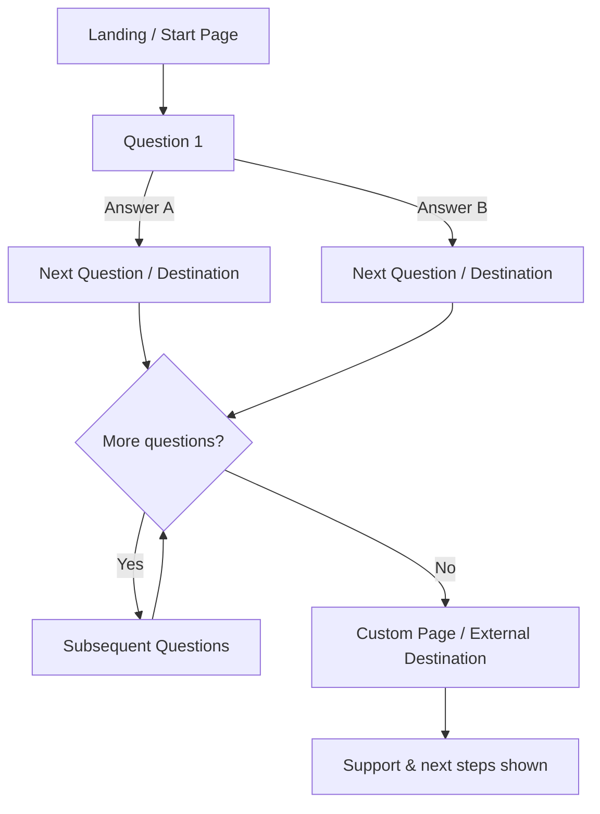
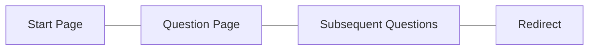

# Frontend — Public Questionnaire Experience

The Frontend project is the public-facing web application that delivers the questionnaire experience to end users. It renders the start page, sequential questions, and supporting content, applying the service design system and client-side enhancements. It consumes published questionnaire data and guides users through the flow until completion or external destinations.

## Key capabilities
- Display questionnaire start page and guidance
- Render questions and capture answers with validation
- Route users based on answer destinations
- Apply service styling and accessibility patterns
- Provide support and privacy information to users

## User flow (high level)

## Pages and purpose

- Start Page: introduces the questionnaire, what to expect, and how to begin.
- Question Page(s): presents each question, validates inputs, and advances the flow.
- Custom Page / Redirect: shows the result or sends the user to an external destination based on answers.
- Privacy Info: explains how information is used.