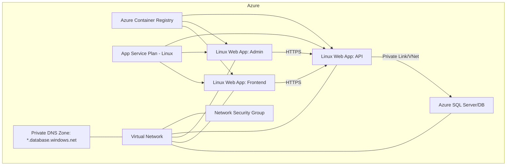
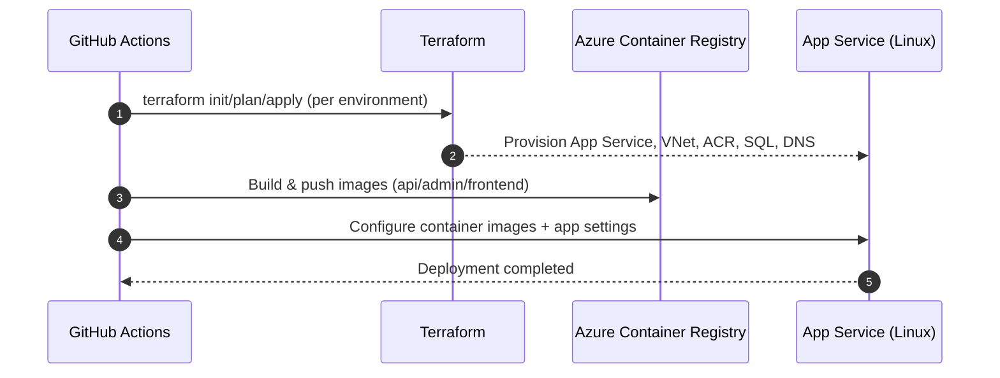
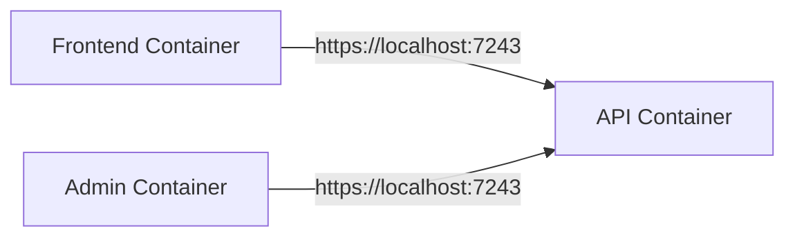

# Infrastructure — Azure, Containers, and Automation

This module defines the cloud infrastructure, local orchestration, and CI/CD automation for the solution. It provisions Azure resources, builds and deploys containerized apps, and supports local development with Docker Compose.

## What it provides
- Azure IaC with Terraform/OpenTofu for consistent, repeatable environments
- App hosting via Linux App Service on a shared plan
- Private networking, NSG, and VNet integration for secure service-to-service access
- Azure Container Registry for application images
- MS SQL Server with private access (via VNet and Private DNS)
- CI/CD pipelines to build and deploy Admin, API, and Frontend
- Local development environment via Docker Compose

## High-level architecture

## Environments
- Development and Test environments are supported via CI inputs and Terraform variable files.
- Remote Terraform state stored in Azure Storage with per-environment state keys.

## CI/CD overview

- Infrastructure workflow: plans and applies Terraform with environment-scoped state.
- App workflows: build images, push to ACR, update App Services, set app settings (including environment and API base URL).

## Networking and security
- Virtual Network with delegated subnet for App Services (Swift integration).
- Network Security Group enforcing least privilege; HTTPS focus.
- Private DNS Zone and VNet integration for secure SQL connectivity.
- HTTPS-only App Services with minimum TLS 1.2.
- ACR credentials supplied securely to App Services.

## Local development
- Docker Compose runs API, Admin, and Frontend together.
- Services communicate internally; environment is set to Local.
- Frontend/Admin use the API via internal container DNS.

## Outputs and configuration
- App settings configured per service (environment, API BaseUrl, connection strings).
- Image names and tags sourced from CI build SHA; ACR used as single source of images.
- Terraform variables control product prefix, location, and image references.