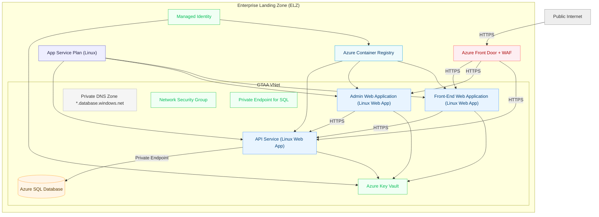
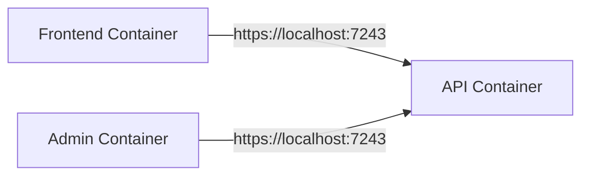
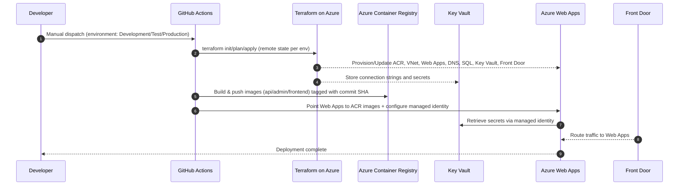

# Infrastructure — Azure, Containers, Networking, and Automation

This folder defines how the platform is provisioned, deployed, and run across environments. It covers cloud resources (Azure), container images, CI/CD pipelines, and a local Docker Compose setup.

## Scope
- Provision Azure resources (App Services, VNet, ACR, SQL, Key Vault, Front Door) via Terraform.
- Build and deploy containerized apps (API, Admin, Frontend) via GitHub Actions to Azure Web Apps (Linux).
- Enforce secure networking with VNet integration and private SQL access via Private Endpoints.
- Centralized secret management via Azure Key Vault with managed identity integration.
- Monitoring and alerting via Azure Monitor (smart detection alerts and metric alerts).
- Provide a local development environment using Docker Compose.

## Service view

## Components

- **Azure Resource Group**: per-environment grouping of assets.
- **App Service Plan (Linux)**: hosts the three Web Apps; SKU configurable per environment.
- **Linux Web Apps**:
  - **API**: serves data to Frontend/Admin; VNet-integrated; HTTPS-only; uses managed identity.
  - **Admin**: back-office UI; calls API over HTTPS; VNet-integrated; uses managed identity.
  - **Frontend**: public site; calls API over HTTPS; VNet-integrated; uses managed identity.
- **Azure Container Registry (ACR)**: stores Docker images for all apps; supports managed identity pulls.
- **Managed Identity**: system-assigned identities for each Web App enabling keyless authentication to ACR and Key Vault.
- **Azure Key Vault**: 
  - Centralized secret storage with RBAC-based access.
  - Stores connection strings, API keys, and application secrets.
  - Integrated with Web Apps via Key Vault references.
  - Configured with purge protection and soft delete.
- **Networking**:
  - **Virtual Network** with delegated subnet for App Services (Swift integration).
  - **Network Security Group** restricting inbound; emphasis on HTTPS-only flows.
  - **Private DNS Zone** for Azure SQL; VNet link for private resolution.
  - **Private Endpoint** for SQL Server providing secure, private connectivity within VNet.
  - Service endpoints configured for Key Vault and SQL.
- **Data**:
  - **Azure SQL Server/Database** with private endpoint access only.
  - Firewall configured to deny public access; accessible only via VNet.
- **Front Door + WAF**:
  - Azure Front Door profile with Standard/Premium SKU (configurable).
  - WAF policy with managed rulesets (Microsoft Default + Bot Protection).
  - Custom security policy for DDoS and bot protection.
  - Origins configured for API, Admin, and Frontend Web Apps.
  - Routes configured for path-based traffic distribution.
- **Monitoring & Alerts**:
  - Action Group for alert notifications (email and optional webhook).
  - Smart Detection Application Insights alerts (anomaly detection, slow performance, memory leaks).
  - Metric-based alerts for high CPU/memory and HTTP error rates (4xx/5xx).
- **Pipelines (GitHub Actions)**:
  - Deploy API/Admin/Frontend (build, push to ACR, update Web Apps).
  - Deploy Infrastructure (Terraform init/plan/apply with remote state).

## Local development

- Docker Compose runs API, Admin, and Frontend together.
- Internal service DNS allows Admin/Frontend to call API at https://localhost:7243.
- ASPNETCORE_ENVIRONMENT=Local is used for all containers.
- Separate compose file for E2E tests (compose-e2e-tests.yaml).

## CI/CD flow (overview)

## Terraform module organization

The infrastructure is split across multiple Terraform files for maintainability:

- **main.tf**: Provider configuration, resource group, App Service Plan, and remote state setup.
- **apps.tf**: Web App definitions (API, Admin, Frontend) with managed identity and VNet integration.
- **network.tf**: VNet, subnets, NSG, Private DNS zones, and VNet links.
- **database.tf**: Azure SQL Server and Database with private endpoint configuration.
- **keyvault.tf**: Key Vault with RBAC roles, secrets storage, and network rules.
- **identity.tf**: Managed identity role assignments for ACR and Key Vault access.
- **frontdoor.tf**: Azure Front Door profile, WAF policy, origins, origin groups, and routes.
- **alerts.tf**: Metric alert rules for CPU, memory, and HTTP errors.
- **smart-alerts.tf**: Application Insights smart detection alerts.
- **action-group.tf**: Alert notification action group.
- **storage.tf**: Azure Storage Account (if applicable).
- **secrets.tf**: Secret definitions stored in Key Vault.
- **variables.tf**: Input variable definitions.
- **outputs.tf**: Output values for reference by other modules or systems.
- **data.tf**: Data sources for existing resources.

Environment-specific configurations:
- **development.tfvars**
- **test.tfvars**
- **production.tfvars**

## Implemented features

✅ **Infrastructure as Code**
- App Services for API, Admin, Frontend on a Linux plan.
- ACR with managed identity integration (no admin credentials needed).
- VNet, delegated subnet, NSG, Private DNS zones, VNet links.
- VNet integration (Swift) for all three Web Apps.
- Private Endpoint for SQL Server with private DNS integration.

✅ **Security**
- HTTPS-only configuration and TLS 1.2 minimum on all Web Apps.
- Managed identities for keyless authentication to ACR and Key Vault.
- Azure Key Vault for centralized secret management with RBAC.
- Private endpoint for SQL ensuring no public internet exposure.
- WAF-enabled Azure Front Door with managed ruleset protection.

✅ **Monitoring & Observability**
- Application Insights integration.
- Smart detection alerts for anomalies, performance issues, and failures.
- Metric alerts for resource utilization (CPU, memory).
- HTTP error rate monitoring (4xx and 5xx responses).
- Email notifications via Action Groups.

✅ **CI/CD**
- GitHub Actions for Infrastructure and each application deployment.
- Image tagging with commit SHA for traceability.
- Remote Terraform state management in Azure Storage.

✅ **Local Development**
- Docker Compose environment with multi-service orchestration.
- E2E test-specific compose configuration.

## Operations guide

### Environment selection
Choose Development, Test, or Production when running workflows. Each has its own `.tfvars` file.

### Image tagging
Deployments use the current commit SHA for traceability. Rollbacks can re-point to a prior tag in ACR.

### Secret management
All secrets are stored in Azure Key Vault. Web Apps reference them using `@Microsoft.KeyVault(...)` notation in app settings.

### Remote Terraform state
State is stored in Azure Storage with a per-environment key. **Never commit local state files.**

### Monitoring
- Check Azure Portal for alert status in the Action Group.
- Review Application Insights for performance metrics and failures.
- Smart detection alerts will notify automatically for anomalies.

## Security checklist

- ✅ HTTPS enforced on all Web Apps; minimum TLS 1.2.
- ✅ Managed identities eliminate credential storage in code/config.
- ✅ SQL Server accessible only via private endpoint within VNet.
- ✅ Key Vault secrets accessed via RBAC with least privilege.
- ✅ Front Door WAF protects against common web vulnerabilities.
- ✅ NSG rules limit network access to required flows.
- ⚠️ Regular review of WAF logs and tuning of security policies recommended.
- ⚠️ Periodic access review for Key Vault RBAC assignments.

## Getting started

1. **Prerequisites**: Azure subscription, Terraform/OpenTofu, Azure CLI.
2. **Configure backend**: Update remote state configuration in `main.tf`.
3. **Set variables**: Review and customize `*.tfvars` files for each environment.
4. **Initialize**: `terraform init`
5. **Plan**: `terraform plan -var-file=development.tfvars`
6. **Apply**: `terraform apply -var-file=development.tfvars`
7. **Deploy apps**: Use GitHub Actions workflows to build and deploy containers.

## Support

For issues or questions about the infrastructure setup, consult the Terraform configuration files or reach out to the platform team.
