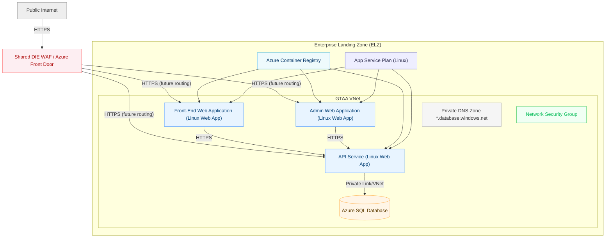
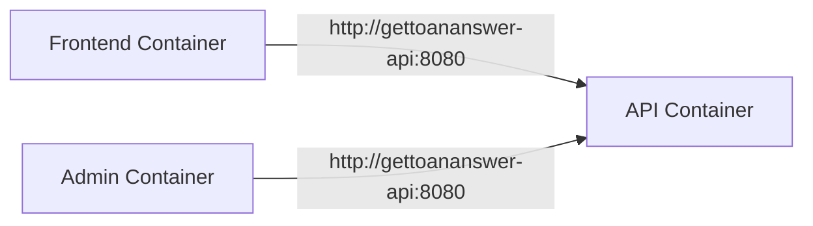
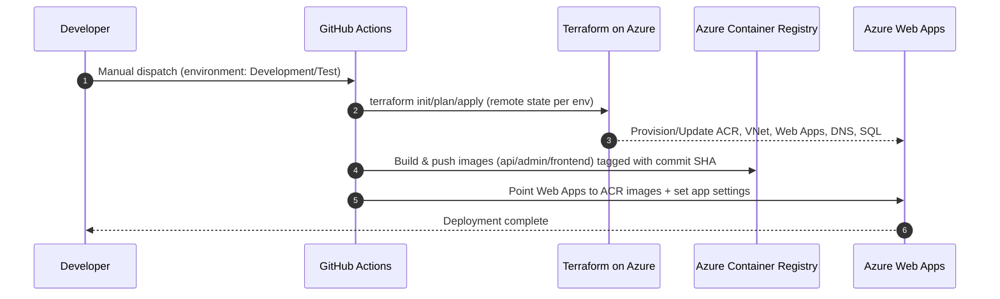

# Infrastructure — Azure, Containers, Networking, and Automation

This folder defines how the platform is provisioned, deployed, and run across environments. It covers cloud resources (Azure), container images, CI/CD pipelines, and a local Docker Compose setup.

## Scope
- Provision Azure resources (App Services, VNet, ACR, SQL, DNS) via Terraform/OpenTofu.
- Build and deploy containerized apps (API, Admin, Frontend) via GitHub Actions to Azure Web Apps (Linux).
- Enforce secure networking with VNet integration and private SQL access.
- Provide a local development environment using Docker Compose.

## Service view

## Components

- Azure Resource Group: per-environment grouping of assets.
- App Service Plan (Linux): hosts the three Web Apps.
- Linux Web Apps:
  - API: serves data to Frontend/Admin; VNet-integrated; HTTPS-only.
  - Admin: back-office UI; calls API over HTTPS; VNet-integrated.
  - Frontend: public site; calls API over HTTPS; VNet-integrated.
- Azure Container Registry (ACR): stores Docker images for all apps.
- Networking:
  - Virtual Network with delegated subnet for App Services (Swift integration).
  - Network Security Group restricting inbound; emphasis on HTTPS-only flows.
  - Private DNS Zone for Azure SQL; VNet link for private resolution.
- Data:
  - Azure SQL Server/Database (referenced in networking and app settings).
- Pipelines (GitHub Actions):
  - Deploy API/Admin/Frontend (build, push to ACR, update Web Apps).
  - Deploy Infrastructure (Terraform init/plan/apply with remote state).

## Local development

- Docker Compose runs API, Admin, and Frontend together.
- Internal service DNS allows Admin/Frontend to call API at http://gettoananswer-api:8080.
- ASPNETCORE_ENVIRONMENT=Local is used for all containers.

## CI/CD flow (overview)

## Implemented vs. planned (unimplemented) items

Implemented
- App Services for API, Admin, Frontend on a Linux plan.
- ACR with admin credentials for image pulls.
- VNet, delegated subnet, NSG, Private DNS zone, VNet links.
- VNet integration (Swift) for all three Web Apps.
- HTTPS-only configuration and TLS 1.2 minimum.
- GitHub Actions for Infrastructure and each application deployment.
- Local Docker Compose environment.

Unimplemented or stubbed (planned)
- Shared DfE WAF/Azure Front Door profile, endpoint, origins, and routes:
  - Front Door resources and per-path routing to API/Admin/Frontend are currently commented/stubbed.
  - When implemented, all public ingress should route via WAF with HTTPS enforcement and origin groups.
- Private endpoints/private link for SQL server (current design uses VNet integration and service endpoints; a private endpoint could further harden access).
- Centralized secret management (e.g., Azure Key Vault) for connection strings and app secrets with managed identity bindings.
- Autoscaling policies and higher SKUs for App Service Plan (currently B1 basic).
- Blue/green or staged deployments (slots) for zero-downtime releases.
- Observability stack (centralized logs/metrics/dashboards and alerting).
- Web Application Firewall policy tuning and custom rules once Front Door is enabled.
- IP allowlists or private ingress for Admin (if required by policy).

## Operations checklist

- Environments: choose Development or Test when running workflows.
- Image tagging: deployments use the current commit SHA; rollbacks can re-point to a prior tag.
- App settings: ensure API base URL and connection strings are set per environment.
- Remote Terraform state: stored in Azure Storage with a per-environment key; do not commit local state.

## Security notes

- Enforce HTTPS only on all Web Apps; minimum TLS 1.2.
- Keep ACR credentials secret; prefer managed identity when feasible (future).
- Restrict SQL access to VNet; consider private endpoint for strongest posture.
- Route external traffic via WAF/Front Door when implemented to centralize security controls.